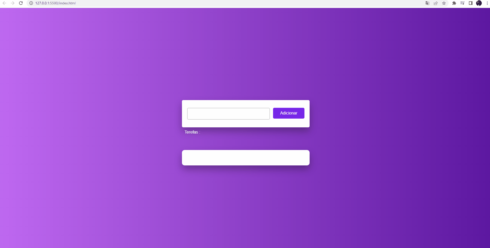

## :blue_book:  Repositório criado para estudos em Javascript com base no desafio da DIO no bootcamp- impulso-Javascript - To-do-list
## :blue_book:   Repository created for Javascript studies based on DIO challenge in bootcamp-impulse-Javascript - To-do-list
### :computer: **Preview do projeto/Preview project** 

 
    

### :red_circle: Sobre o projeto 
#### Este projeto é uma lista de tarefas, o famoso To-do-list, foi construído com base no desafio-dio do bootcamp Impulso javascript, utilizei HTML5, CSS, JAVASCRIPT para realizar o projeto **projeto**

#### This project is a to-do list, the famous To-do-list, was built based on the Impulso javascript bootcamp challenge, uses HTML5, CSS, JAVASCRIPT to carry out the project**project**

### :link: https://62e5586fc322be2b5f055c00--friendly-kitsune-d4b951.netlify.app/

### :hammer: Skills utilizadas/Skills used  

 
    

### :mortar_board: Projeto desenvolvido para estudos/project developed for studies 